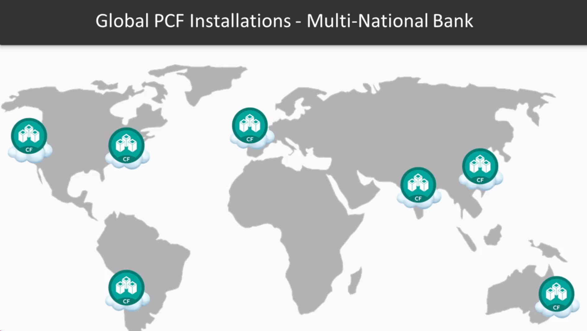
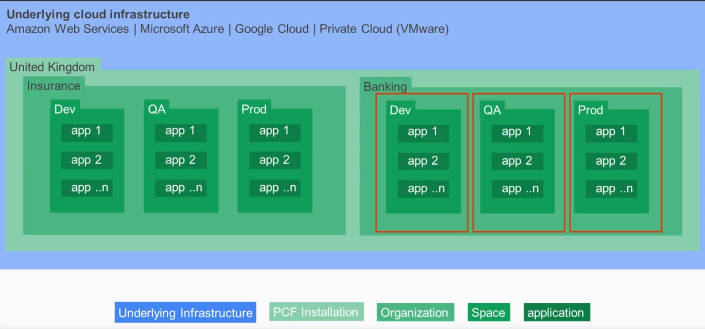
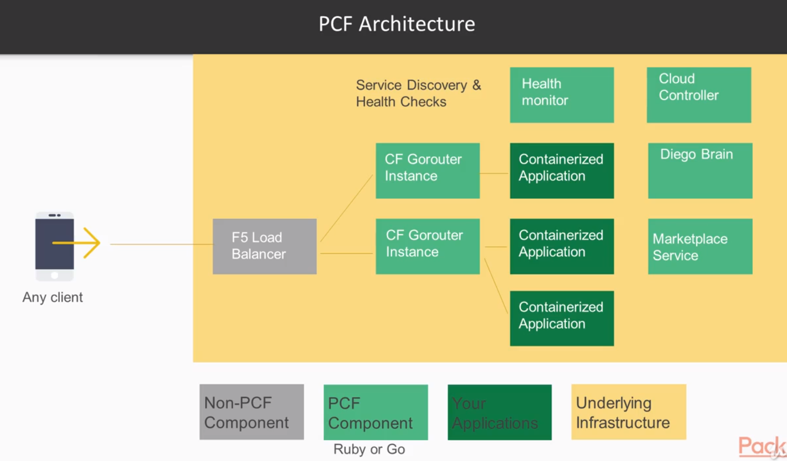
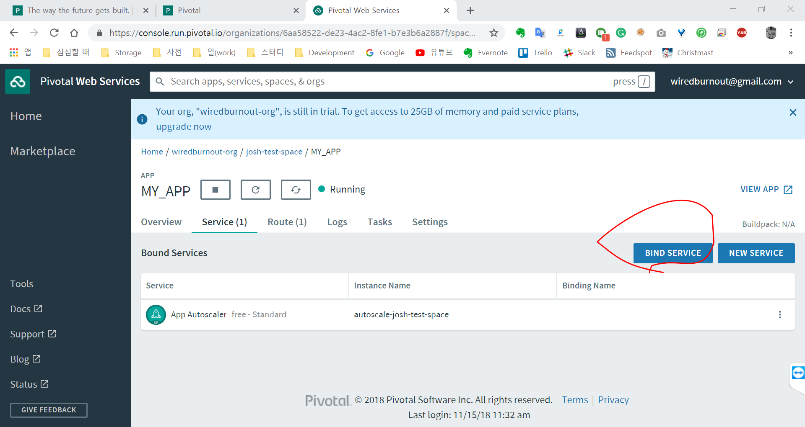

# Learning the Cloud Foundry for Web Developers

## Table of Contents

# 2. Setting Up Your Workspace
* Required Downloads
* Eclipse STS v4.7.0 (as our IDE)
    * https://spring.io/tools3/sts/all 
* execute sts.exe by clicking an icon
* Eclipse Gradle Buildship plugin (to Build our apps)
* in STS, help -> eclipse marketplace -> in marketplace, search 'gradle'  -> select 'Buildship Gradle integration 2.0'
* Cloud Foundry Command Line Tool v6 (to interact with PCF)
    * https://docs.cloudfoundry.org/cf-cli/install-go-cli.html 
* bash on windows
    * https://www.youtube.com/watch?v=g1RnCITU-Wg&t=0s&list=PLg71zF6ERjn5ylvM3-IaYGeCDQnD_574z&index=4 
* 소스코드를 eclipse에 불러오기
* import -> existing gradle project 했음.
* 앱 push
* cd ./app_name
* cf push 수행
* manifest.yml 에 선언된 대로 앱 생성됨. 


# 3. Navigating the PCF Console
* The differences between PCF, PWS and PCF Dev
* Signing up for PWS and navigating the console
* where to find documentation in the PCF console
* Creating  your first org and space
* Exploring the PCF marketplace

* PWS: https://run.pivotal.io/


# 4. Using the CF command line interface to interact with PCF
* Take a look at following: 
User-Provided Service (개념)
> * UPS instances enable developers to use services that are not available in the marketplace with their applications running on Cloud Foundry (유저제공서비스 인스턴스들 CF상의 app이 CF 마켓에서 사용할 수 없는 서비스를 개발자가 사용할 수 있게 해줌)
>
> * User-provided service instances can be used to deliver service credentials to an application, and/or to trigger streaming of application logs to a syslog compatible consumer. (사용자 제공 서비스 인스턴스를 사용하여 서비스 자격 증명을 응용 프로그램에 전달하거나 응용 프로그램 로그를 syslog 호환 가능 consumer에게 스트리밍 할 수 있습니다)
>
> * Once created, user-provided service instances behave like service instances created through the marketplace; see managing service instances and application binding for details on listing, renaming, deleting, binding, and unbinding

* 내용
    * UPS: CF에 배포된 앱이 CF 외부에 위치한 외부서비스와 통신하기 위해서 credential을 주입해주고, 앱의 로그를 외부로그집계 서비스 (syslog 호환규격)에 스트리밍 할 수 있게 한다.
    * CF User Provided Service
    * Usage: cf cups
    * User-provided services allow developers to use services that are not available in the marketplace, like MongoDB and Cassandra
    * User-Provided service instances can be used to deliver service credentials to an application, and/or to trigger streaming of application logs to storage like Log stash (ELK): 요약 -> Stream Application
    * Once created, user-provided service instances behave like service instances created through the marketplace
* 예제
    * Deliver Service Credentials to an Application:
        * 예) 클라우드 파운드리 외부에서 관리되는 카산드라 데이터베이스와 우리의 앱이 통신하는 것이 필요로한다고 가정. UPS는 우리가 PCF에 저장하는 간단한 credentials(자격증명)임. pcf는 이 credentials을 우리의 앱에 주입해줌.
    * Stream Application Logs to a Service:
        * UPS 인스턴스를 사용하면 개발자는 응용 프로그램 로그를 PCF 외부에서 관리되는 syslog 호환 집계 서비스로 스트리밍 할 수 있습니다
* Summary
    * __*UPS (User-Provided Service): CF에 배포된 앱이 CF 외부에 위치한 외부서비스와 통신하기 위해서 credential을 주입해주고, 앱의 로그를 외부로그집계 서비스 (syslog 호환규격)에 스트리밍 할 수 있게 한다.*__
    * *We can login to PCF using the CF CLI with CF Login Command (CF CLI에서 CF login 명령으로 PCF에 로그인)*
    * *We can create an org using the create-org command (create-org 명령으로 org 생성)*
    * *We can create a space using the create-space command (create-space 명령으로 space 생성)*
    * *We can create a user-provided service using the cups command (cups 명령으로 user-provided service 생성)*
    * *We can push an app to PCF using the CF push command (CF push 명령으로 애플리케이션을 pcf에 배포)*
    * _참고 링크 : https://docs.cloudfoundry.org/cf-cli/getting-started.html _
```
로그인 명령어
cf login -a https://api.run.pivotal.io -u wiredburnout@gmail.com -p xxxxxxxx --skip-ssl-validation
```

# 5. PCF Architecture, Orgs, and Spaces
* Take a look at followings: 
    > * PCF deployment and conceptual architecture
    > * PCF logical and component architecture
    > * PCF orgs and spaces

## Global World Banking Service (요런 서비스를 개발/운영한다고 가정해보자)
* Service Area (오홍 나의 서비스 커버리지)
        

* Banking Service Logical architecture (이런 형상으로 애플리케이션을 유지: Dev, QA, Prod)
        

* CF Architecture for Banking Service (레알 CF 내부 구조)
        

* Summary
    * *PCF is made up of over 15 specialized Ruby/Go Apps (PCF는 루비/Go 앱으로 구성되어 있음)*
    * *The Diego brain is a service within PCF that allocates resources (디에고 브레인은 리소스 할당하는 서비스 임)*
    * *The CF Router facilitates routing and service registry within PCF (CF 라우터는 PCF내에서 라우팅과 서비스 등록을 담당)*
    * *The Cloud Controller exposes a REST interface (클라우드 컨트롤러는 REST API 인터페이스를 노출시킴)*
    * *The UAA is an OAuth 2 Server within PCF (UAA는 PCF의 Oauth2 서버임)*
    * *Applications and Resources are organized into orgs and spaces (애플리케이션과 리소스들은 org와 space로 조직화 되어 있음)*


# 6. Roles, Permissions and Marketplace Services
* Take a look at followings: (요런걸 살펴보시겠다)
    > * PCF Roles and Their Permissions (PCF의 역할과 권한)
    > * Provisioning a service from the marketplace using the web console (웹콘솔가지고 마켓플레이스에서 서비스 프로비저닝하기)
    > * Provisioning a service from the marketplace using the CF CLI (CF CLI 가지고 마켓플레이스에서 서비스 프로비저닝하기)
    > * What it means to bind a marketplace service to a java application (마켓플레이스 서비스를 자바 애플리케이션으로 바인드 하는 것의 의미)

 
## PCF Roles and Permissions
    Role|Permission
    --- | ---
    Admin|Has permissions on all orgs and spaces and can perform operational actions using the Cloud Controller API
    Admin Read-Only| Has read-only access to all Cloud Controller API resources 
    Global Auditor | Has read-only access to all Cloud Controller API resources except for secrets such as environment variables 
    Org Managers |Can administer the org
    Org Auditors|Can view but cannot edit user information and org quota usage information
    Org Billing Managers |Can create and manage billing account and payment information 
    Space Managers | Can administer a space within an org 
    Space Developers |Can manage applications and services in a space 
    Space Auditors |Can view but cannot edit the space 


* Push app, change app, scale app, delete app and create/use a marketplace service
    --> It is important for developers (윗 한줄이 개발자 입장에서 젤루 중요한 거시다)

* How to provision a marketplace service in your space using CF CLI command (마켓플레이스 서비스 생성 및 생성결과 확인 / CF CLI 로 해본다는 거시다)

HOWTO:
```
* cf marketplace: check available marketplace service (사용가능한 서비스확인)
* cf create-service app-autoscaler standard appAutoscaler: create service (서비스 생성)
    * app-autoscaler: service name
    * standard: plan name
    * appAutoscaler: custom your service name
* cf service appAutoscaler: check service status you created (생성한 서비스 상태 확인)
```

## How to bind the marketplace service to your app (나의 앱과 마켓플레이스 서비스 연결: 요기서는 웹페이지에서 작업했삼)
HOWTO:
    * Login PWS -> Bind Service in this page
           
        * (https://console.run.pivotal.io/organizations/6aa58522-de23-4ac2-8fe1-b7e3b6a2887f/spaces/a2d0bbb5-3e34-41b3-80a6-bea186e20352/applications/39df0f2f-022c-4647-b7ab-e8f43e2cb1ad/services)

    * In PCF, goto app -> settings -> environment variables: runtime에 입력되는 파라미터들임
        * VCAP_SERVICES:  ---> 배포한 APP과 marketplace service를 바인딩한 후 App이 마켓플레이스 서비스를 사용할 수 있도록 CF가 credentials을 여기에 주입시킴
    * "실제로 appAutoscale라는 서비스를 마켓에서 찾아서 바인딩 했다. 그리고 바인딩된 서비스를 찬찬히 살펴보고 어떤 기준으로 자동스케일링을 할지 설정해봤다. 좋구먼."


* Summary
    * _Admin, org manager, org user provide high-level permissions (admin, org매니저, org유저는 높은수준의 권한을 갖는다잉)_
    * _Space manager and space user privileges are usually for developers (Space 매니저와 Space 유저는 보통수준의 권한을 갖는다. 흠...보통이라..)_
    * _The marketplace provides managed services like MySQL and Redis (마켓플레이스는 MySQL, Redis같은 매니지드 서비스를 제공한다.)_
    * _Marketplace services are only accessible by apps within the same space (마켓플레이스 서비스는 같은 space안있는 앱들에 의해서만 접근가능!)_


# 7. Application Monitoring, Logs, and Build Packs
* Take a look at followings:
    > * Observing metrics in the PCF console (메트릭 보는 법)
    > * Observing application logs in the PCF console (app log 보는 법)
    > * Identifying what a build pack is in PCF (buildpack 은 무엇?)
    > * Understanding of what is happening when we 'cf push' an app (앱 push 하면 무슨 일이 발생할까?)


## What happens when I cf push?
HOWTO:
```
create your app (in the cloud foundry): cf push 명령은 cloud controller를 호출하고 cloud controller에게 app을 생성하도록 시킨다.
-> store your app (in the cloud foundry): app과 app 정보를 Blob Store에 upload 한다.
-> notice your app (in the cloud foundry)
-> containerize your app (in the cloud foundry): 해당 app을 실행하기 위해서 Diego brain은 리소스를 프로비저닝 (create cell and vm) 한다.
-> deploy your app (in the cloud foundry): 해당 cell에 containerized app 복사본이 deploy 된다.
```
[그림삽입] 1:36

HOWTO:
```
cd projects/deployment
git clone https://github.com/Altoros/cf-example-sinatra
cd projects/deployment/cf-example-sinatra
cf push

manifest.yml 을 해당 디렉토리에 포함시킬 수 있다. 여기엔 app instance 갯수, memory limit, runtime arguments 등을 설정할 수 있다
```

* offline buildpack: cached buildpack인데, 라이브러리 종속성을 해결하기 위해 관련된 걸 모두 패키징한 빌드팩. 인터넷 연결이 필요없음.

* Logging (loggregator: 다수 앱 인스턴스에서 모두 가져와서 본다)
[그림삽입]: 7:47


* Summary (ch 1 ~7)
    * _We setup our environment (환경셋팅 배웠음)_
    * _We explored different ways to interact with PCF (PCF 와 상호소통하는 여러방법을 알아봤음)_
    * _We learned about PCF conceptual and logical architecture (PCF의 개념적, 논리적 구조를 배웠음)_
    * _We learned about orgs, spaces, roles and permissions (orgs, space, roles and permissions에 대해서 배웠음)_
    * _We learned about  application monitoring, logging and buildpacks (앱 모니터링, 로깅, 빌드팩을 배웠음)_


# Develop and Deploy a Web Service to PCF (Section 2)

# 8. Provisioning a SQL Database from the PCF Marketplace
* Take a look at followings:
    > * How to provision a database from the marketplace (마켓플레이스에서 데이터베이스 가져다가 프로비저닝하기) 
    > * Using Eclipse to create a new Spring boot application (신규 스프링부트 애플리케이션 생성을 위해 이클립스 사용하기)
    > * How to leverage auto-configuration to boot strap your application (너의 앱을 구동시키기 위해 자동설정을 활용하는 방법)
    > * Creating your application's manifest YAML (너의 앱 매니페스트 만들기)
    > * Building your application using the Gradle plugin within Eclipse (이클립스에서 Gradle 플러그인을 사용하여 너의 앱을 빌드하기)
    > * Deploying your application using the cf push command (cf push 명령을 사용하여 너의 앱을 배포하기)
    > * Monitoring your application PCF and sending requests to it using Postman (너의 앱 모니터링하고 포스트맨 사용하여 요청보내기)
    > * @마켓플레이스 서비스프로비저닝 -> @이클립스 사용 -> @앱구동 자동설정 -> @앱 매니페스트 생성 -> @앱 빌드 (with gradle) -> @앱 배포 (cf push) -> @앱 모니터링 및 테스트

## Selecting and provisioning a SQL database from the marketplace
* __Provisioning a Database from Marketplace__  
    - HOWTO: Provisioning a Database from Marketplace  
    `Access pivotal.io -> Select your Space -> click Services tab -> add service -> select clearDB MySQL DB`
        + We got DB immediately without DB installation!! This is the big benefits of Cloud Foundry.  
        + The resource for db is handled automatically by Diego Brain

* __Checking information about DB__  
    - HOWTO: Checking information about DB
    ```
    Access pivotal.io 
    -> Select your Space 
    -> click Services tab 
    -> click the your db service 
    -> click Manage link 
    -> show up confirmation page 
    -> select allow 
    -> URL Redirection for clearDB vendors
    -> you can check the performance, location of your DB instance
    ```

## Binding the service to our application
HOWTO: Binding the service to our application
```
Access pivotal.io
-> go to your app
-> select services tab
-> click the bind service button
-> select cleardb service
```

* Summary  
__(1) service provisioning from marketplace ->__
__(2) bind the service to you app ->__
__(3) Restaging your app ->__
__(4) push your app again__

    - DB서비스를 앱에 bind 하면, 프로비저닝 된 서비스를 니 앱에 바인드하면 너의 앱을 다시 스테이징 하고 앱을 다시 push 해야 한다. 그리고 VCAP서비스에 의해서 런타임 파라미터에 DB서비스에 대한 Credential이 너의 앱에 주입된다.
    - (1),(2) 는 개발자수행 (3),(4) 는 CF수행
    - We can select a suitable data store from the marketplace 
    - We can choose the space that we want the service to be available in
    - Databases in the PWS marketplace are fully-managed
    - We can bind  an app to a marketplace service
    - When  an app is bound to a service, PCF passes the credentials to the  app via the VCAP_SERVICES runtime argument


# 9. Using Eclipse to Create a New Spring Boot Application
* Take a look at followings:
    > * Navigating the Eclipse STS IDE (이클립스 STS IDE 살펴보자잉)
    > * Creating a new Spring boot application (스프링부트 애플리케이션 작성해보자잉)

* JDK download (SE 1.8)
* Eclispse STS IDE download

<HOWTO: Creating a new Spring boot application>
```
Eclipse STS IDE 실행 -> file-New -> Spring Starter Project 선택
```

* jar / war -> 여기서 jar 선택한 이유는 임베디드 되어 있는 서버 컨테이너를 가지고 있고 거기서 실행될거라고 생각하기 때문임. 마치 임베디드 톰캣처럼... 
* 
* 


Summary
* We can use Eclipse STS to create new spring boot apps
* Spring boot apps can be built as JAR or WAR files
* Maven or Gradle are used for application builds and dependency management
* Eclipse uses Spring Initializer to generate our Spring boot projects


10. Leveraging Auto Configuration to Bootstrap Your Application
* Take a look at followings:
* How PCF adds a profile to our application
* How our Spring boot apps know to configure beans with VCAP_SERVICES credentials


Dev / QA / PROD 마다 사용하는 DB가 다르기 때문에 Credentials 또한 다름. 그래서 Credentials Injection 을 별도로 해야함.


* Dev case (개발계에 연결하고 싶을 때의 설정)


@
app 을 다른 환경 (prod/qa/dev)은 어떻게 연결할까? pcf 가 spring profile을 app이 실행(RUN)될 때 inject해준다. 
spring profile 은 application.yml 에 정의되어 있다.
이걸 Runtime configuration 의 vm 항목에 설정하면 된다. (-Dspring.profile.active=cloud)
* 여기까진 어느 형상 (PROD/QA/DEV) 으로 연결할지 설정하는 방법임. (아래화면 참고)


@
CF는 credentials을  VCAP_SERVICE 에 담아서 런타임에 app에 주입(inject)한다.
스프링 라이브러리는 cloud profile을 찾도록 하드코딩되어 있다.
cloud profile은 vcap_service를 사용하도록 beans를 설정한다. 그리고 아규먼트들은 vcap_service에 담긴다.
* 여기까진 연결할 형상이 결정되었을때, 연결에 필요한 정보들이 어디에 담겨있는지, 언제 사용하는지에 대한 내용임.
* 요약 : 연결정보, credentials등은 vcap_service에 담겨있음. (아래화면참고)


Summary
* Spring boot auto-configuration is a feature of the library that provides smart default configuration for beans 
* Spring boot auto-configuration reduces the need for boilerplate configuration code
* Spring component scan detects and initializes beans in the class path with smart defaults
* Spring auto-configuration helps developers finish application faster


11. Creating Your Application’s Manifest YAML File
* Take a look at followings:
* What role a manifest YAML file plays when pushing an application to PCF (앱을 push 할때, manifest 의 역할이 무엇일까?)
* A manifest that describes a single app (싱글 앱설정을 위한 manifest)
* A manifest that describes multiple apps (멀티 앱설정을 위한 manifest)
* Exploring the manifest documentation and other possibilities with manifests (docs 보고 여러가지 시도해보기)


manifest.yml 내용 (for single app)
---
applications:
- name: customer-1xyz
  memory: 1gb
  instances: 1
  path: ./build/libs/restwebservcice-1.jar
  services:
  - mysql
CF는 기본적으로 앱을 push 할때 모른다. CF CLI 는  jar파일이 어디있는지 모르기 때문에 jar file이 어디에 있는지 말해줘야 함. (난, CF 가 jar 파일위치를 모른다는 것으로 이해함)


multiple-apps-manifest.yml 내용
---
applications:
- name: customer
  memory: 1G
  instances: 2
  host: customer-1xyz
  domain: example.com
  path: ./path/to/bits
  services:
  - mysql
- name: equities
  memory: 1G
  instances: 2
  host: equities-1xyz
  domain: example.com  
  path: ./path/to/bits
  services:
  - redis

참고: https://docs.cloudfoundry.org/devguide/deploy-apps/manifest.html


Summary
* The manifest YAML describes how the application should be deployed, what resources and services it need, etc.  (앱의 배포방법, 앱에서 필요한 리소스, 서비스 등등의 정보를 가지고 있음)
* The manifest YAML can describe memory limit, number of app instances, app name, and other properties (manifest.yml은 메모리 limit, 앱 개수, 앱 이름 등등 의 정보를  가지고 있음)
* We can list one or serveral applications in the manifest YAML (manifest.yml에 하나  또는 그 이상의 앱들을 목록화 할 수 있다)
* The manifest YAML is only used by PCF during the CF push process. (manifest.yml은 CF가 사용하는 설정파일임: CF를 위해서 작성하는 거임)


12. Developing Our Web Service and Building it Using Gradle
* Take a look at followings: (흠. 이 챕터가 spring boot 배우는 챕터인 듯)
* Developing our web service 
* Using Spring data to persist and retrieve an object from our database
* Cleaning and building our application using Gradle

* Gradle 보기


* clean 실행


Summary
* Gradle is a dynamic build  tool that helps manage dependencies
* Gradel and Maven have similar uses
* Gradle  looks for the build.gradle, written in groovy


13. Deploying Your Application to PCF Using the CF Command Line
* Take a look at followings:
* Deploying our application to PCF


* PCF Plugin for Jenkins CI


Summary
* CF CLI stands for Cloud Foundry Command Line Interface 
* Apps must be pushed to  PCF using the CF push command 
* Once pushed, we can monitor the running  application in the PCF web console


14. Viewing the Final App and Testing with Postman
* Take a look at followings:
* Using Postman to test our app

Summary
* We can create a micro-service that persists an object to a MySQL database using Spring data (MySQL을 사용하는 마이크로서비스를 만들어봤음)
* We can build our micro-service using Gradle and deploy it to PCF using CF push (Gradle로 마이크로 서비스를 빌드하고 CF push 로 PCF 에  deploy 해봤음)
* We can use Postman to send requests to our service and verify that it works (Postman으로 서비스 테스트 해봤음)


# Develop and Deploy an Event-Driven Micro Service to PCF (Section 3)
* Take a look at followings:
* Provision RabbitMQ from the PCF marketplace (RabbitMQ 프로비저닝하기)
* Developing a producer and consumer application using Spring boot (producer 와 consumer 앱 개발하기 with Spring boot)
* How PCF injects runtime arguments into your app for auto-configuration (설정 자동화를 위해 PCF 가 앱에 런타임 아규먼트를 주입하는 법)
* Building your applications using Maven (Maven으로 앱 building 하기)
* Deploying your applications without a manifest YAML file (manifest.yml 없이 앱 배포하기)
* Confirming your application works by viewing messages in the RabbitMQ Dashboard (RabbitMQ 대쉬보드에서 메세지 확인하여, 앱 작동을 컨펌하기)


15. Provisioning a RabbitMQ Message Broker from the PCF Marketplace
* Take a look at followings:
* Creating a RabbitMQ marketplace service (RabbitMQ 서비스 생성)h
* Logging into the RabbitMQ dashboard (RabbitMQ 대시보드 에 로그인하기)
* Creating a queue in the RabbitMQ dashboard (RabbitMQ 대시보드에서 Queue 만들기)

* RabbitMQ 생성 -> RabbitMQ 인스턴스 이름도 만든다.


* RabbitMQ Details & management 접속하기


* RabbitMQ Details window


* RabbitMQ Dashboard (위 화면에서 RabbitMQ Manager 클릭)

* Create a RabbitMQ Queue (큐 만들기)
* Queue name is "dkQueue"

Done!!!

Summary
* The PCF marketplace provides fully-managed services for our apps with little effort
* We can provision RabbitMQ from the marketplace
* Once RabbitMQ is provisioned, we can access the RabbitMQ console to create channels and queues

16. Developing the Producer and Consumer Applications with Spring Boot
* Take a look at followings:
* Creating the consumer application using Eclipse
* Boot strapping a RabbitMQ listener within your application
* Boot strapping a RabbitMQ producer application

* 코드 import 해서 훑어보길 추천

* Publisher application
* publish a message to the Queue
* Consumer application
* listen continually for items coming onto the Queue
* take an item off the queue and put it in another database
* 예제설명
    * Client request '/publish' with item (payload)
    * Publisher app puts the item on the Queue
    * Consumer are listening the same Queue and take the item off the Queue
    * and will print the item

Summary
* PCF applies the 'cloud' spring profile to our spring boot micro-service (PCF는 cloud spring profile을 spring boot micro-service에 적용한다)
* Almost zero configuration is needed for our consumer and producer applications (consumer, producer application을 위해 설정이 거의 필요없다.)
* With developers releasing micro-services more quickly, businesses become more agile (개발자들이 더 빨리 마이크로 서비스를 내놓으므로써, 비지니스가 더 민첩해진다)


17. How PCF Injects Properties into Your App for Auto Configuration
* Take a look at followings:
* How to access the VCAP_SERVICES from within your app (너으 앱안에서 VCAP_SERVICES 를 접근하는 방법)
* Printing a credential from VCAP_SERVICES to the console (VCAP_SERVICES에서 credentials을 콘솔로 프린팅하는 법)

* 코드에서 '/vcap' api 를 살펴보자

Summary
* VCAP_SERVICES is a runtime argument that PCF adds to our app at runtime (VCAP_SERVICE는 PCF가 런타임에 내 앱에 주입해주는 런타임 아규먼트임)
* VCAP_SERVICES contains all of the credentials our app needs to connect to the marketplace service (VCAP_SERVICES는 marketplace service에 접속하는데 필요한 credentilas을 가지고 있음)
* VCAP_SERVICES is a JSON string (JSON 포멧임)
* An example of the credentials are host address, username, password

18. Building Your Application Using Maven
* Take a look at followings: 
* Using Eclipse Maven to clean your application (maven clean 이해)
* Using Eclipse Maven to install your application (maven install 이해)
* Locating the JAR that was created within our application (maven install의 결과)
* Inspecting the JAR to make sure it was created successfully

* Maven Clean 실행
* maven clean 하면 target folder 의 작업물을 모두 삭제한다.


* maven install 실행
* maven install 실행하면 패키징하고 일종의 unit test 실행한다
* 그리고, target folder 에 jar/war 를 deploy한다
* CF 는 요기에 있는 jar를 실행한다
    


Summary
* The maven build tool requires that projects contain a maven.pom XML file (pom 파일이 필요)
* Maven helps to manage dependency libraries (의존성 라이브러리 관리해줌)
* Maven pulls dependencies from your local Maven .m2 repository and from the web (의존성 라이브러리들을 로컬 및 웹에서 가져옴)
* You can visit maven central to view publicly accessible code libraries 


19. Deploying Your Application Using the CF Command Line Without Manifest YAML File
* Take a look at followings: 
* Creating a cf push command to push our app without a manifest YAML (manifest.yml 없이 앱 push 를 위한 cf push 명령어 만들기)
* Pushing our app without a manifest YAML (manifest.yml 없이 앱 push 하기)


* manifest.yml 없이 앱 push 하는 명령어
    * cf push publisher-1xyz -i 1 -m 1gb -p ./target/publisher-1.jar
        * -i (instance) -m (memory) -p (path)

Summary
* We  can push our applications to PCF without a manifest YAML 
* Rather than use a manifest YAML, we can add arguments to the CF push command
* We can also apply properties and bind services to our apps via the CF CLI


20. Confirming Your Application Works by Viewing Messages in the RabbitMQ Dashboard
* Take a look at followings: 
* Publish a message to our app using Postman
* View the message in the RabbitMQ dashboard
* Create a message within the RabbitMQ dashboard

Summary
* We can easily publish and listen on a RabbitMQ message queue using the spring boot starter rabbit library
* We can  create a fully-managed rabbit instance from the marketplace
* We can leverage auto configuration to developer event-driven micro-services with minimal code


Mastering Pivotal Cloud Foundry for Web Developers

21. The Course Overview
* Section 1 - PCF Core Concepts Advanced
* Section 2 - PCF Architecture
* Section 3 - Deploy a Micro-services Supporting Architecture to PCF
* Section 4 - Bringing It All Together

* Prerequisites
* Object-oriented programming with java
* Computer networking concepts (HTTP, REST)
* Object-relational mapping (Hibernate) and databases (MySQL, MongoDB)
* Message queues
* The Spring framework: Inversion-of-control (IoC) and aspect-oriented programming

# PCF Core Concepts Advanced (Section 1)
* Take a look at followings:
* PCF in a production environment: CI with Jenkins and disaster recovery strategies (젠킨스로 CI하기 그리고 DR 전략)
* Security considerations in PCF: Security groups, and container-to-container security (CF에서의 보안고려사항: 컨테이너간 네트워킹 보안)
* Resource limitations in PCF (PCF에서의 리소스 제한)
* Exploring the PCF log aggregator (log aggregator 살펴보기)
* Autoscaling applications in PCF and leveraging the Cloud Foundry SDK (PCF에서 앱을 자동확장하기 그리고 CF SDK 활용하기)
* Route services, volume services, and user-provided services (cf cups) (라우트 서비스, 볼륨 서비스, 사용자 제공 서비스)


22. CI with Jenkins and Disaster Recovery Strategies
* Take a look at followings:
* Using the Cloud Foundry plugin for Jenkins to push our application to PCF (젠킨스가 우리 앱을 pcf에 배포하기위해서 필요한 Cloud Foudry 플러그인 사용하기)
* A deployment model for achieving high availability for PCF (고가용성 획득을 위한 배포 모델)
    ** Routing to two different PCF installations using F5 load balancer
* Understanding active-active and active-passive disaster recovery strategies (ActiveActive & ActivePassive DR 전략 이해하기)

* Difference Between Blue-Green and Active-Active
    * Blue-green: Zero-downtime deployments strategy
        * 신규 버전의 앱을 push 하면 신규 앱이 배포되는 동안 downtime이 발생
        * 배포되는 완료할 때까지 old 버전 앱으로 서비스 요청을 보내야함. 
            * cf map-route 명령어로 처리함
    * Active-Active: Disaster Recovery strategy
        * Active-Active는 사용자 요청이 primary data center (dc) 와 backup dc 로 분산된다.
        * Active-passive는 사용자 요청이 primary data center로만 간다.

* DR 구성 살펴보기
    * 코드 배포방식


1. User commits code to git
2. Jenkins can poll git periodically
    * Jenkins fetch the code and get it and then build it using Maven or Gradle plugin for Jenkins
3. Using the CF plugin, Jenkins can push apps to PCF
    *  Jenkins would deploy the jar that was built or war file to Cloud Foundry


* 고가용성 (High Availability)을 위한 CF 설계방식
    * 방법 1 (CF 내부 컴포넌트를 여러 리전에 걸쳐서 구축)


    * 방법 2 (동일 사이트를 구축해서 Active-Active 또는 Active-Passive 로 운영, 동일 사이트구축비용발생으로 비쌈)
        * Active-Active


        * Active-Passive


Summary
* Used the CF plugin for Jenkins to deploy apps to PCF (젠킨스가 PCF에 앱을 배포하도록 CF 플러그인을 사용했음)
* Used F5 load balancer to balance requests across two geographically distinct PCF installations (지리적으로 구별되도록 설치된 2개의 PCF 에 걸쳐 사용자 요청을 분배했음 via F5)
* Studied that Active-Active is when requests are actively routed to both the primary and disaster (DR) recovery instances (사용자요청이 Primary 와 Backup(DR) 인스턴스로 라우팅되는 것은 AA임)
* Studied Active-Passive is when requests are only sent to the disaster recovery (DR) PCF installation if the primary installation goes down (사용자 요청이 Primary 인스턴스가 다운되었을 경우에 Backup(DR) 인스턴스로 라우팅 될때는 AP 임)


23. Security Groups and Container-to-Container Security
*  Take a look at followings:
* Managing application security in PCF
* Container-to-container security in PCF
* Security groups in PCF


* app a 가 app b를 호출할 수 있는 경로


* app a가 app b를 호출하는 기능 (2017년 11월에 추가된 기능)
    * Container to Container Networking 을 가능하게 하기 위해서  discovery server를 이용하고 Spring boot discovery client library 를 이용함
        * Container to container authentication 기능도 존재


* Authentication 을 할 수 있는 곳
    * Gateway 에서 가능
    * Gorouter에서 가능
    * App 에서 가능
    * Container to Container Auth 기능으로 가능


* App A가 App B에게 요청하는 방법 (Auth 서버에서 JWT형태의 Bearer 토큰을 발급받아서 App B에게 요청하는 Flow)
    * 이건 container to container security와는 관계없음. 스프링부트 보안 기능을 활용하는 방법임.


* App A가 App B에게 요청하는 방법 (Container to Container Networking/Security 를 사용는 방법)
    * 스프링부트의 시큐리티 메카니즘을 이해할 필요없음. 대신 Con to Con Networking을 사용할 꺼니까


    * App B는 App A에서 들어오는 Request만 accept 하는 설정만 하면 됨 (like a whitelist)
        * 복잡한 spring security 설정필요없음


Summary
* Learned that we can leverage container-to-container security for application security in PCF (앱 보안을 위해서 컨테이너to컨테이너 보안기술을 활용)
* Discussed that in order to leverage container-to-container security, we need to leverage the discovery service ( 컨테이너to컨테이너 보안기술활용을 위해서 discovery service 기술이 필요)


24. Resource Limitations in PCF


* Diego Cell is VM.

Summary
* Learned that Orgs and Spces have configured memory limits
* Understood that the network throughput is determined by the configuration of the underlying infrastructure/virtual machines


25. Exploring the PCF Log Aggregator
* Take a look at followings:
* How to monitor streaming logs in the PCF web console using the PCF loggregator
* Other options for operational intelligence with PCF, including integration the ELK stack and Splunk, as well as performance monitoring tools like AppDynamics

* PCF Logs: Loggregator
    * App developer can tail their application logs or dump the recent logs from Cloud Foundry Command Line Interface (cf CLI), or stream these to a third-party log archive and analysis service (CF CLI 로 로그 Tail 하거나 Dump 또는 써드파티서비스에 로그를 스트리밍할 수 있음)

    * Operators와 Admin은 Firehose 를 통해서 모든 App 로그, CF 컴포넌트의 Metrics Data 를 접근한다.
    * Nozzles 은 특정이벤트 메트릭스와 외부서비스로 가는 data stream에 관해 firehose를 모니터링한다.


* PCF Logs: User-Provided Service for Sending System Logs to a Remote Service
    * Log Management Services는 마켓에서 찾을 수 있음. 아니면, 우리가  외부로그관리 서비스 (Splunk) 연결정보를 포함시켜서 User-provided service 를 만들 수 있음
    * Log drain service라는 것을 명시하기 위해서 -l 옵션을 사용
        * cf create-user-provided-service SERVICE-INSTANCE -l SYSLOG-URL
    * 일단 App에 로그서비스가 Bind 되면, PCF Loggregator 에서 안 나타나는 게 가능.
    * 로그서비스 접근을 제한하는 pcf 아웃바운드 네트워크 설정구성 필요.

Summary
* Noticed that the loggregator in PCF allows us to watch the logs coming from our applications in real time (로그리게이터를 통해서 실시간 앱로그를 확인가능)
* Found that the loggregator aggregates logs from all of an apps instances so we can view the logs in a central location (로그리게이터는 앱인스턴스들의 모든 로그를 수집하여, 중앙위치에서 볼 수 있게함)


26. Auto-Scaling Apps and the Cloud Foundry SDK
* Take a look at followings:
* Binding an AppAutoscaler from the marketplace to our applications in PCF
* Understanding the AppAutoscaler marketplace service

* AppAutoscaler Marketplace service
    * 5초에 한번씩 바인딩된 앱을 폴링함.
    * cpu-utilization 이 높은 경우 --> Cloud Controller에게 App 인스턴스 숫자를 증가시키라는 API Call 함.
    * 사용자는 App instance 의 미니멈, 맥시멈 숫자를 설정할 수 있음.
    * 


* Cloud Foundry SDK
    * Cloud Foundry Operation 을 코드기반으로 가능 (scale up 같은 동작)

Summary
* The AppAutoscaler service polls apps for high CPU utilization and creates a nd removes app instances accordingly


27. Route, Volume, and User-Provided Services
* Take a look at followings:
* What the benefits of route services are and how to provision them
* What the benefits of volume services are and how to provision them
* What the benefits of user-provided services are and how to provision them

* Route Service
    * https://docs.cloudfoundry.org/services/route-services.html#service-instance-responsibilities
    * Fully-Brokered Service
        * Request Flows: All Request ---> CF Router ---> Router Service --- (transform requests/process requests) ---> LB ---> CF Router ---> App
            *  transform requests/process requests: modifying payload etc. (router service에서 Request를 수정할 수 있음)
    * Example Route Services
        * Logging Route Service (로깅하는 서비스)
            * https://github.com/cloudfoundry-samples/logging-route-service
        * Rate Limiting Route Service (속도제어하는 서비스)
            * https://github.com/cloudfoundry-samples/ratelimit-service
        * Spring Boot Example
            * https://github.com/nebhale/route-service-example

* Volume Service
    * 


28. Achieve a Blue-Green Deployment
29. Cloud Controller and the CF API
30. Route Traffic with CF Gorouter
31. The Garden Container
32. The Diego Brain and Allocation of Resources
33. The Internal PCF OAuth 2.0 Auth Server (UAA)
34. Understanding, Provisioning and Configuring the Config Server
35. Creating and Manipulating the Discovery Server
36. Constructing the Circuit-Breaker Dashboard
37. Understanding Hystrix and Circuit- Breaker Pattern
38. Bootstrapping the Microservices to Connect to the Supporting Services
39. Deploying the Microservices to PCF Using a Manifest
40. Config, Discovery and Circuit-Breaker Dashboards
41. Spring Boot Actuator and Refreshing Properties
